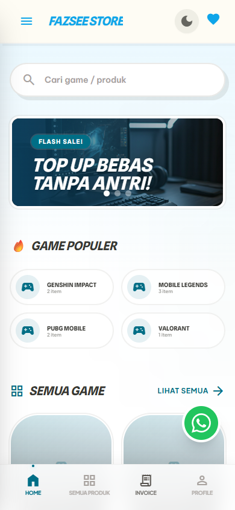
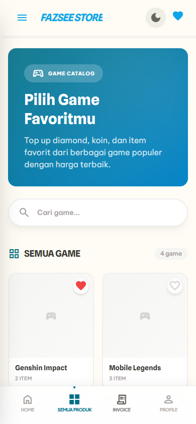
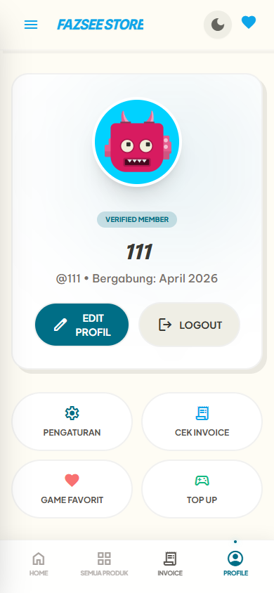

# Fazsee Store 🎮

**Platform top-up game & pembelian produk digital** — dibangun dengan arsitektur Full-Stack modern, PWA-ready, dan tampilan premium.

<div align="center">
  
  &nbsp;&nbsp;
  
  &nbsp;&nbsp;
  
  &nbsp;&nbsp;
  
</div>

---

## ✨ Fitur Lengkap

### 🛒 Storefront
- **Katalog Game Dinamis** — Kategori dengan ikon & deskripsi, form kustom per-game (User ID, Server Zone, dll)
- **Checkout Wizard** — Multi-step (Akun → Produk → Qty → Payment → Contact → Review)
- **Wishlist** — Simpan game favorit ke local storage
- **Dark Mode** — Toggle tema gelap/terang, persisten

### 💳 Sistem Pembayaran
- **QRIS Payment** — Gambar QR dinamis, dikelola dari admin dashboard
- **Transfer Manual** — Rekening bank/e-wallet dikonfigurasi dari admin
- **Countdown Timer** — Batas waktu pembayaran 15 menit
- **Upload Bukti Bayar** — User upload screenshot pembayaran

### 📦 Manajemen Pesanan (Shopee-style)
- **Tab Status** — Semua / Menunggu / Dibayar / Diproses / Selesai / Gagal
- **Order Timeline** — Progress visual dari pembelian sampai selesai
- **Auto-redirect** — Klik order PENDING → langsung ke halaman pembayaran

### 💬 Live Chat P2P
- **Chat Real-time** — Komunikasi admin ↔ buyer per-order
- **Auto-close** — Sesi chat terkunci otomatis saat order selesai/gagal

### 📊 Admin Dashboard
- **Analytics** — Revenue chart 7 hari, stat cards, top produk, distribusi status
- **Manajemen Pesanan** — Terima/tolak order dengan satu klik
- **CRUD Kategori & Produk** — Tambah/edit/arsipkan langsung dari dashboard
- **Pengaturan Toko** — Upload QRIS, kelola rekening bank, nomor WA admin
- **WhatsApp Notifikasi** — Auto-buka WA dengan pesan template saat status order berubah

### 🔒 Keamanan & Performa
- **JWT Authentication** — Role-based (User / Admin)
- **Rate Limiting** — Throttle 100 req/menit
- **Helmet + Compression** — Security headers & GZIP
- **SWR Caching** — Stale-While-Revalidate untuk zero loading
- **Progressive Web App** — Installable, offline-capable
- **SEO Optimized** — OpenGraph, Twitter Cards, meta tags

---

## 🛠️ Tech Stack

| Layer | Teknologi |
|-------|-----------|
| **Frontend** | React 19, Vite, Tailwind CSS, SWR, React Router, React Helmet |
| **Backend** | NestJS 11, Prisma ORM 7, PostgreSQL, Passport.js |
| **Storage** | Cloudinary (images), Multer (upload) |
| **PWA** | vite-plugin-pwa, Service Worker, Web Manifest |
| **Deployment** | Vercel (frontend), Railway/Render (backend) |

---

## 🚀 Quick Start (Local Development)

### Prasyarat
- **Node.js** ≥ 18.x
- **Git**

### 1. Clone & Install

```bash
git clone https://github.com/Dzakiudin/Fajar-Store.git
cd Fajar-Store
```

### 2. Setup Backend

```bash
cd backend
npm install
cp .env.example .env
# Edit .env → isi DATABASE_URL, JWT_SECRET, CLOUDINARY keys
```

**Start database (Prisma Dev):**
```bash
npx prisma dev
```

**Di terminal baru, sync schema & start server:**
```bash
cd backend
npx prisma db push
npx prisma generate
npm run start:dev
```

> API berjalan di `http://localhost:3000`

### 3. Setup Frontend

```bash
cd frontend
npm install
cp .env.example .env
# Edit .env → pastikan VITE_API_URL=http://localhost:3000/api
npm run dev
```

> Frontend berjalan di `http://localhost:5173`

### Quick Run (3 terminal):
```
Terminal 1: cd backend && npx prisma dev
Terminal 2: cd backend && npm run start:dev
Terminal 3: cd frontend && npm run dev
```
---

## 📁 Struktur Project

```
Fajar-Store/
├── frontend/                # React + Vite
│   ├── src/
│   │   ├── components/      # Reusable components
│   │   │   ├── admin/       # Admin dashboard tabs
│   │   │   └── wizard/      # Checkout wizard steps
│   │   ├── layouts/         # Navbar, BottomNav, Footer
│   │   ├── pages/           # Route pages
│   │   ├── services/        # API service layer
│   │   └── utils/           # Formatters, helpers
│   ├── public/              # Static assets (QRIS, OG image)
│   └── vercel.json          # Vercel deployment config
│
├── backend/                 # NestJS API
│   ├── src/
│   │   ├── admin/           # Admin endpoints + analytics
│   │   ├── auth/            # JWT + Passport authentication
│   │   ├── categories/      # Game categories CRUD
│   │   ├── cloudinary/      # Image upload service
│   │   ├── orders/          # Order management
│   │   ├── payments/        # Payment processing
│   │   ├── products/        # Product CRUD
│   │   ├── settings/        # Store settings (QRIS, bank)
│   │   └── common/          # Guards, filters, pipes
│   ├── prisma/              # Schema + migrations
│   └── Dockerfile           # Production Docker build
│
└── docs/                    # Screenshots
```

---

## 📄 API Endpoints

### Public
| Method | Endpoint | Description |
|--------|----------|-------------|
| `POST` | `/api/auth/register` | Register user |
| `POST` | `/api/auth/login` | Login → JWT token |
| `GET` | `/api/categories` | List all categories |
| `GET` | `/api/categories/:id` | Category detail + products |
| `GET` | `/api/products` | List products |
| `GET` | `/api/settings` | Store settings (QRIS, bank) |

### Authenticated (User)
| Method | Endpoint | Description |
|--------|----------|-------------|
| `GET` | `/api/auth/profile` | Get user profile |
| `POST` | `/api/orders` | Create order |
| `GET` | `/api/orders/:id` | Get order detail |
| `POST` | `/api/payments/upload-proof` | Upload payment proof |
| `GET` | `/api/orders/:id/messages` | Get chat messages |
| `POST` | `/api/orders/:id/messages` | Send chat message |

### Admin Only
| Method | Endpoint | Description |
|--------|----------|-------------|
| `GET` | `/api/admin/analytics` | Dashboard analytics |
| `GET` | `/api/admin/orders` | All orders |
| `PATCH` | `/api/admin/orders/:id/status` | Update order status |
| `CRUD` | `/api/admin/categories` | Manage categories |
| `CRUD` | `/api/admin/products` | Manage products |
| `PATCH` | `/api/settings` | Update store settings |

---

## 📄 Lisensi

© 2026 Ahmad Dzakiudin. Semua hak dilindungi.

Kode ini bersifat **proprietary** — tidak diizinkan untuk digunakan dalam produksi komersial tanpa izin tertulis dari pemilik.